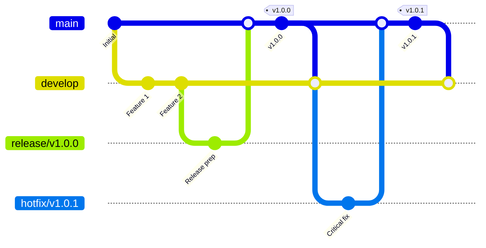

# 📋 GanttChart WebUI バージョニング戦略

## 概要

このドキュメントは、GanttChart WebUIプロジェクトのバージョン管理戦略、リリースプロセス、および関連する開発ワークフローを定義します。

## バージョニング方針

### Semantic Versioning (SemVer) 準拠

本プロジェクトは [Semantic Versioning 2.0.0](https://semver.org/) に完全準拠します。

**バージョン形式**: `MAJOR.MINOR.PATCH` (例: `1.0.0`)

#### バージョン番号の意味

| 種類 | 増加条件 | 例 | 説明 |
|------|----------|----|----- |
| **MAJOR** | 破壊的変更 | `1.0.0` → `2.0.0` | 既存機能との後方互換性を失う変更 |
| **MINOR** | 機能追加 | `1.0.0` → `1.1.0` | 後方互換性を維持した新機能追加 |
| **PATCH** | バグ修正 | `1.0.0` → `1.0.1` | 後方互換性を維持したバグ修正 |

#### プレリリース識別子

開発中・テスト中のバージョンには以下の識別子を使用します。

| 識別子 | 用途 | 例 | 説明 |
|--------|------|----|----- |
| `alpha` | 開発初期版 | `1.1.0-alpha.1` | 機能開発中、安定性未保証 |
| `beta` | ベータ版 | `1.1.0-beta.1` | 機能完成、テスト中 |
| `rc` | リリース候補 | `1.1.0-rc.1` | 本番リリース直前版 |

### 統一バージョン管理

#### モノレポ統一ポリシー

- **Backend** と **Frontend** は **同一バージョン番号** を維持
- 片方のみの変更でも、両方のバージョンを同期更新
- 互換性と管理性を重視したモノレポアプローチ

#### バージョン同期確認

```bash
# バージョン統一性チェック
npm run version:check:all

# 手動確認
cd backend && npm run version:check
cd frontend && npm run version:check
```

## ブランチ戦略 (GitFlow 準拠)

### ブランチ種類

| ブランチ | 用途 | 命名規則 | 例 |
|----------|------|----------|---- |
| `main` | 本番リリース | `main` | `main` |
| `develop` | 開発統合 | `develop` | `develop` |
| `feature/*` | 機能開発 | `feature/{issue-id}-{description}` | `feature/M10-05-version-management` |
| `release/*` | リリース準備 | `release/v{version}` | `release/v1.0.0` |
| `hotfix/*` | 緊急修正 | `hotfix/v{version}` | `hotfix/v1.0.1` |

### ブランチフロー



## リリースプロセス

### 1. 開発フェーズ

#### Feature ブランチ開発

```bash
# 1. Feature ブランチ作成
git checkout develop
git pull origin develop
git checkout -b feature/M10-05-version-management

# 2. 開発・コミット
git add .
git commit -m "feat: implement version management system"

# 3. プッシュ・プルリクエスト
git push origin feature/M10-05-version-management
```

#### 開発完了時のマージ

```bash
# Develop へのマージ（スカッシュマージ推奨）
git checkout develop
git merge --squash feature/M10-05-version-management
git commit -m "feat: add version management system for M10-05"
git push origin develop
```

### 2. リリース準備フェーズ

#### Release ブランチ作成

```bash
# 1. Release ブランチ作成
git checkout develop
git pull origin develop
git checkout -b release/v1.1.0

# 2. バージョン番号更新
./scripts/release.sh prepare 1.1.0

# 3. リリース準備作業
# - CHANGELOG.md 更新
# - RELEASE_NOTES.md 作成
# - 最終テスト実行
```

#### リリース前確認

```bash
# バージョン統一性確認
npm run version:check:all

# 包括的テスト実行
./scripts/release.sh test

# ビルド確認
./scripts/release.sh build
```

### 3. リリースフェーズ

#### Main ブランチへのマージ

```bash
# 1. Main ブランチマージ
git checkout main
git pull origin main
git merge --no-ff release/v1.1.0
git push origin main

# 2. タグ作成
git tag -a v1.1.0 -m "Release v1.1.0: Feature enhancement and bug fixes"
git push origin v1.1.0

# 3. Develop ブランチマージ
git checkout develop
git merge main
git push origin develop

# 4. Release ブランチ削除
git branch -d release/v1.1.0
git push origin --delete release/v1.1.0
```

### 4. ホットフィックスフェーズ

#### 緊急修正プロセス

```bash
# 1. Hotfix ブランチ作成
git checkout main
git pull origin main
git checkout -b hotfix/v1.0.1

# 2. 修正・テスト
# 緊急修正の実装
npm run test
npm run build

# 3. バージョン更新
./scripts/release.sh patch

# 4. Main・Develop マージ
git checkout main
git merge --no-ff hotfix/v1.0.1
git tag -a v1.0.1 -m "Hotfix v1.0.1: Critical security fix"
git push origin main
git push origin v1.0.1

git checkout develop
git merge main
git push origin develop
```

## 自動化スクリプト

### Release Script (`scripts/release.sh`)

#### 使用方法

```bash
# バージョン準備
./scripts/release.sh prepare 1.1.0

# テスト実行
./scripts/release.sh test

# ビルド実行
./scripts/release.sh build

# タグ作成・プッシュ
./scripts/release.sh tag 1.1.0

# 完全リリースプロセス
./scripts/release.sh release 1.1.0
```

#### スクリプト機能

- **バージョン同期**: Backend・Frontend package.json の統一更新
- **自動テスト**: 包括的テストスイートの実行
- **ビルド検証**: プロダクションビルドの成功確認
- **タグ管理**: Git タグの自動作成・プッシュ
- **CHANGELOG 生成**: 自動的な変更履歴更新

### npm Scripts

#### Backend (`backend/package.json`)

```json
{
  "scripts": {
    "version:check": "echo \"Backend Version: $(node -p 'require(\"./package.json\").version')\"",
    "version:bump:patch": "npm version patch --no-git-tag-version",
    "version:bump:minor": "npm version minor --no-git-tag-version",
    "version:bump:major": "npm version major --no-git-tag-version"
  }
}
```

#### Frontend (`frontend/package.json`)

```json
{
  "scripts": {
    "version:check": "echo \"Frontend Version: $(node -p 'require(\"./package.json\").version')\"",
    "version:bump:patch": "npm version patch --no-git-tag-version",
    "version:bump:minor": "npm version minor --no-git-tag-version",
    "version:bump:major": "npm version major --no-git-tag-version"
  }
}
```

## CI/CD 統合

### GitHub Actions ワークフロー

#### Release Workflow (`.github/workflows/release.yml`)

```yaml
name: Release
on:
  push:
    tags:
      - 'v*'

jobs:
  release:
    runs-on: ubuntu-latest
    steps:
      - uses: actions/checkout@v4
      - name: Setup Node.js
        uses: actions/setup-node@v4
        with:
          node-version: '20'
      
      - name: Install dependencies
        run: |
          cd backend && npm ci
          cd frontend && npm ci
      
      - name: Run tests
        run: |
          cd backend && npm run test
          cd backend && npm run test:e2e
          cd frontend && npm run test:e2e
      
      - name: Build applications
        run: |
          cd backend && npm run build
          cd frontend && npm run build
      
      - name: Create GitHub Release
        uses: actions/create-release@v1
        env:
          GITHUB_TOKEN: ${{ secrets.GITHUB_TOKEN }}
        with:
          tag_name: ${{ github.ref }}
          release_name: Release ${{ github.ref }}
          body_path: RELEASE_NOTES.md
          draft: false
          prerelease: false
```

#### Version Check Workflow

```yaml
name: Version Check
on:
  pull_request:
    branches: [main, develop]

jobs:
  version-check:
    runs-on: ubuntu-latest
    steps:
      - uses: actions/checkout@v4
      - name: Check version consistency
        run: |
          BACKEND_VERSION=$(node -p "require('./backend/package.json').version")
          FRONTEND_VERSION=$(node -p "require('./frontend/package.json').version")
          
          if [ "$BACKEND_VERSION" != "$FRONTEND_VERSION" ]; then
            echo "❌ Version mismatch: Backend($BACKEND_VERSION) != Frontend($FRONTEND_VERSION)"
            exit 1
          fi
          
          echo "✅ Version consistency verified: $BACKEND_VERSION"
```

## バージョン管理ツール

### 推奨ツール

#### 1. conventional-changelog

```bash
# インストール
npm install -g conventional-changelog-cli

# CHANGELOG.md 自動生成
conventional-changelog -p angular -i CHANGELOG.md -s
```

#### 2. standard-version

```bash
# インストール
npm install -g standard-version

# 自動バージョンバンプ・CHANGELOG更新
standard-version

# プレリリース
standard-version --prerelease alpha
```

#### 3. release-it

```bash
# インストール
npm install -g release-it

# インタラクティブリリース
release-it

# 設定ファイル (.release-it.json)
{
  "github": {
    "release": true
  },
  "npm": {
    "publish": false
  }
}
```

## 品質保証

### リリース前チェックリスト

#### ✅ コード品質

- [ ] **Lint チェック通過**: `npm run lint` (Backend & Frontend)
- [ ] **型チェック通過**: TypeScript エラーなし
- [ ] **テストカバレッジ**: 80%以上維持
- [ ] **セキュリティスキャン**: 脆弱性チェック完了

#### ✅ 機能検証

- [ ] **ユニットテスト**: 全テスト通過
- [ ] **統合テスト**: API エンドポイント検証
- [ ] **E2Eテスト**: ユーザーシナリオ検証
- [ ] **パフォーマンステスト**: レスポンス時間基準値達成

#### ✅ デプロイメント検証

- [ ] **ビルド成功**: プロダクションビルドエラーなし
- [ ] **Docker イメージ**: 正常なコンテナ起動確認
- [ ] **環境設定**: 本番環境設定値の確認
- [ ] **データベースマイグレーション**: スキーマ変更の検証

#### ✅ ドキュメント更新

- [ ] **CHANGELOG.md**: 今回の変更内容記載
- [ ] **RELEASE_NOTES.md**: リリースノート作成
- [ ] **README.md**: 必要に応じて更新
- [ ] **API ドキュメント**: Swagger/OpenAPI 更新

### テスト戦略

#### 自動テスト実行

```bash
# Backend テスト
cd backend
npm run test          # ユニットテスト
npm run test:cov      # カバレッジ付きテスト
npm run test:e2e      # E2Eテスト

# Frontend テスト
cd frontend
npm run test:e2e      # Cypress E2Eテスト
npm run cypress:run   # ヘッドレスモード
```

#### 手動テスト項目

1. **認証フロー**: プロジェクトログイン・権限確認
2. **Issue 管理**: CRUD操作・バリデーション
3. **WBS 機能**: ツリー表示・ドラッグ&ドロップ
4. **ガントチャート**: タイムライン表示・依存関係
5. **リアルタイム機能**: WebSocket通信・通知

## 破壊的変更管理

### 破壊的変更の定義

以下の変更は **MAJOR バージョン** での実装が必要です。

#### API 変更

- **エンドポイント削除**: 既存 API の廃止
- **レスポンス形式変更**: フィールド削除・型変更
- **認証方法変更**: 認証フローの根本的変更
- **必須パラメータ追加**: 新規必須フィールドの導入

#### データベーススキーマ

- **テーブル削除**: 既存テーブルの廃止
- **カラム削除**: 既存フィールドの削除
- **データ型変更**: 互換性のない型変更
- **制約変更**: 外部キー・一意制約の変更

#### 環境要件

- **Node.js バージョン**: サポート範囲の変更
- **データベースバージョン**: 最小要求バージョンの引き上げ
- **ブラウザサポート**: 対応ブラウザ範囲の変更

### 破壊的変更のプロセス

#### 1. 事前告知（N-1 バージョン）

```markdown
## [1.5.0] - 2025-06-01

### Deprecated
- **API v1 エンドポイント**: v2.0.0 で削除予定
- **Legacy 認証**: 新認証システム移行推奨

### Migration Guide
- [v2.0.0 Migration Guide](docs/MIGRATION_v2.0.0.md)
```

#### 2. マイグレーションガイド作成

```markdown
# v2.0.0 Migration Guide

## Breaking Changes

### API Endpoints
- `GET /api/v1/projects` → `GET /api/v2/projects`
- Response format changed: `data` wrapper removed

### Database Schema
- `projects.password` → `projects.password_hash`
- Migration script: `scripts/migrate_v2.0.0.sql`

### Environment Variables
- `DB_URL` → `DATABASE_URL`
- `JWT_SECRET` → `AUTH_SECRET_KEY`
```

#### 3. 段階的移行支援

- **Dual Support**: 旧・新システムの並行稼働
- **Migration Script**: 自動移行ツールの提供
- **Rollback Plan**: 緊急時の巻き戻し手順

## 長期サポート (LTS)

### LTS ポリシー

| バージョン | サポート期間 | セキュリティ更新 | 機能更新 |
|------------|--------------|------------------|----------|
| **1.x** | 18ヶ月 | ✅ | ❌ |
| **2.x** | 24ヶ月 | ✅ | ❌ |
| **Current** | 継続 | ✅ | ✅ |

### サポート終了プロセス

```markdown
## [1.10.0] - 2025-12-01

### Notice
- **v1.x サポート終了**: 2026年6月1日
- **推奨アップグレード**: v2.x系への移行開始
- **セキュリティ更新**: 重要な脆弱性のみ対応
```

## トラブルシューティング

### よくある問題

#### バージョン不整合

```bash
# 問題: Backend と Frontend のバージョンが異なる
# 解決: 統一スクリプト実行
./scripts/release.sh sync-versions
```

#### マージコンフリクト

```bash
# package.json のコンフリクト解決
git checkout --ours package.json
npm run version:bump:minor
git add package.json
git commit -m "resolve: version conflict"
```

#### タグ作成失敗

```bash
# 既存タグの削除・再作成
git tag -d v1.0.0
git push origin :refs/tags/v1.0.0
git tag -a v1.0.0 -m "Release v1.0.0"
git push origin v1.0.0
```

### サポート・問い合わせ

- **GitHub Issues**: [バージョン管理関連の問題](https://github.com/your-org/GanttChartWebUI/issues)
- **Discord**: #version-management チャンネル
- **Email**: devops@ganttchart-webui.com

---

## 付録

### 参考資料

- [Semantic Versioning](https://semver.org/)
- [Conventional Commits](https://www.conventionalcommits.org/)
- [Git Flow](https://nvie.com/posts/a-successful-git-branching-model/)
- [Keep a Changelog](https://keepachangelog.com/)

### 改訂履歴

| バージョン | 日付 | 変更内容 |
|------------|------|----------|
| 1.0.0 | 2025-01-15 | 初版作成・v1.0.0 リリース対応 |

---

**最終更新**: 2025年1月15日  
**ドキュメントバージョン**: 1.0.0  
**適用プロジェクトバージョン**: v1.0.0+